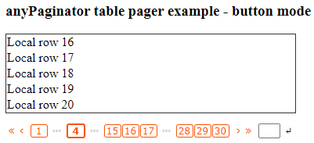

# anyPaginator
An easy to use, yet advanced and fully customizable javascript/jQuery paginator. 

<br/>

Take a look at the jsFiddle demos:

* "Hello world":     https://jsfiddle.net/arnemorken/2qf7k4cs/46/
* Local table data:  https://jsfiddle.net/arnemorken/0snofdq7/23/
* Remote table data: https://jsfiddle.net/arnemorken/kou1r0e6/8/

# Download

- Github repository:                  https://github.com/arnemorken/anypaginator/
- Balanse Software (minified):        https://balanse.info/cdn/anypaginator/anyPaginator.min.zip (coming soon)
- Balanse Software (source/examples): https://balanse.info/cdn/anypaginator/anyPaginator.zip (coming soon)

# Usage

1. Include the anyPaginator Javascript and CSS files:

```html
<script src="/path/to/anyPaginator.js"></script>
<link  href="/path/to/anyPaginator.css" rel="stylesheet"/>
```

2. Provide a place for the paginator and its' associated data to live:
```html
<div id="mypager"></div>
<div id="mydata"></div>
```

3. Initialize the paginator and add some pages:
```js
let num = 200;
let pager =  $("#mypager").anyPaginator({ onClick: function() { refreshData(pager); } });
for (let i=1; i<=num; i++) {
  // Add a page number each rowsPerPage rows
  if (!((i-1) % pager.options.rowsPerPage)) {
    pager.anyPaginator("add");
  }
}
```

4. Display some data initially:
```js
refreshData(pager);
```

5. Have the onClick calback function redraw the contents according to the page number selected:
```js
function refreshData(pager)
{
  $("#mydata").empty();
  let start = (pager.currentPage - 1) * pager.options.rowsPerPage + 1;
  let stop  = start + pager.options.rowsPerPage - 1;
  for (let i=start; i<=stop; i++) {
    $("#mydata").append("<p>Local row "+i+"</p>");
  }
}
```

# License

Released under the AGPL v3 license: https://choosealicense.com/licenses/agpl-3.0/

### See also the anyList project: https://github.com/arnemorken/anylist
