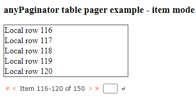

# anyPaginator [](https://github.com/arnemorken/anypaginator/actions/workflows/codeql-analysis.yml) 
An easy to use, yet advanced and fully customizable Javascript/jQuery paginator plugin.
anyPaginator is a spinoff of the <a href="https://github.com/arnemorken/anyvista">anyVista</a> project
and we think it's the best Javascript paginator out there. 

<br/>
<br/>
<br/>

Take a look at the jsFiddle demos:

* "Hello world":     https://jsfiddle.net/arnemorken/2qf7k4cs/57/
* Page or item mode: https://jsfiddle.net/arnemorken/q72byd8f/3/
* Image pagination:  https://jsfiddle.net/arnemorken/fm2hpgc0/3/
* Local table data:  https://jsfiddle.net/arnemorken/0snofdq7/35/
* Remote table data. This example currently (18/4 2023) not working, will be fixed soon. Download latest version for a working example.  jsfiddle.net/arnemorken/kou1r0e6/24/

Both pages and items can be added to the paginator. In the latter case, page buttons will be added automatically as needed. 
The recommended method is to simply set the "numItems" option. Pages and/or items may be added or removed dynamically at any time.

The user provides a callback function to redraw data whenever a button is pressed, anyPaginator takes care of the rest.
The callback function will receive the pager as its only parameter.

# Download

Current version: 1.1.0

- Github repository:                  https://github.com/arnemorken/anypaginator/
- Balanse Software (minified):        https://balanse.info/cdn/anypaginator/anypaginator-1.1.0.min.zip
- Balanse Software (source/examples): https://balanse.info/cdn/anypaginator/anypaginator-1.1.0.zip

# Usage

1. Include the anyPaginator Javascript and CSS files:

```html
<script src="/path/to/anyPaginator.js"></script>
<link  href="/path/to/anyPaginator.css" rel="stylesheet"/>
```

2. Provide a place for the paginator and its' associated data to live:
```html
<div id="mypager"></div>
<div id="mydata"></div>
```

3. Initialize the paginator and add some pages:
```js
let pager = $("#mypager").anyPaginator({ onClick: refreshData });
pager.numItems(200);
```

4. Display some data initially:
```js
refreshData(pager);
```

5. Have the onClick calback function redraw the data according to the page number selected:
```js
function refreshData(pager)
{
  $("#mydata").empty();
  let start = (pager.currentPage() - 1) * pager.options.itemsPerPage + 1;
  let stop  = start + pager.options.itemsPerPage - 1;
  for (let i=start; i<=stop; i++)
    $("#mydata").append("<p>Hello row "+i+"</p>");
}
```

# API

### Options

| Option                       | Description                                                    | Type                         | Default                    |
| ---------------------------- | -------------------------------------------------------------- | ---------------------------- | -------------------------- |
| mode                         | 0: buttons, 1: page number, 2: item range.                     | Number                       | 0                          |
| hideIfOne                    | If true, hide the paginator if there is only one page          | Boolean                      | true                       |
| itemsPerPage                 | Number of items per page                                       | Number                       | 20                         |
| splitLeft                    | Number of split buttons to the left                            | Number                       | 3                          |
| splitMiddle                  | Number of split buttons in the middle                          | Number                       | 3                          |
| splitRight                   | Number of split buttons to the right                           | Number                       | 3                          |
| pageText                     | Text in front of page number for mode == 1                     | String                       | "Page"                     |
| itemText                     | Text in front of item range for mode == 2                      | String                       | "Item"                     |
| gotoText                     | Text on the "goto" button, ignored if gotoIcon is set          | String                       | "Go"                       |
| prevText                     | Text on the "previous" button, ignored if prevIcon is set      | String                       | "&lsaquo;"                 |
| nextText                     | Text on the "next" button, ignored if nextIcon is set          | String                       | "&rsaquo;"                 |
| firstText                    | Text on the "first" button, ignored if firstIcon is set        | String                       | "&laquo;"                  |
| lastText                     | Text on the "last" button, ignored if lastIcon is set          | String                       | "&raquo;"                  |
| gotoIcon                     | Font Awesome icon on the "goto" button instead of gotoText     | String                       | null                       |
| prevIcon                     | Font Awesome icon on the "previous" button instead of prevText | String                       | null                       |
| nextIcon                     | Font Awesome icon on the "next" button instead of nextText     | String                       | null                       |
| firstIcon                    | Font Awesome icon on the "first" button instead of firstText   | String                       | null                       |
| lastIcon                     | Font Awesome icon on the "last" button instead of lastText     | String                       | null                       |
| hideGoto                     | Whether to hide the "goto" button/input field                  | Boolean                      | false                      |
| hidePrev                     | Whether to hide the "previous" button                          | Boolean                      | false                      |
| hideNext                     | Whether to hide the "next" button                              | Boolean                      | false                      |
| hideFirst                    | Whether to hide the "first" button                             | Boolean                      | true                       |
| hideLast                     | Whether to hide the "last" button                              | Boolean                      | true                       |
| onClick                      | User defined event handler for button click                    | Function                     | undefined                  |

### Public methods

#### Constructor
Initialize options and properties and redraw the paginator.
```js
// Initialize the plugin with default values
var pager = $("#mydiv").anyPaginator();

// Initialize the plugin with 10 items per page, 2 buttons on the left and right side and a Font Awesome icon for the ellipsis:
var pager = $("#mydiv").anyPaginator({ 
                          itemsPerPage: 10,
                          splitLeft:    2,
                          splitRight:   2,
                          ellipsisIcon: "fa-thin fa-ellipsis-stroke",
                        });
```

#### reset(options)
Reset options and properties and redraw the paginator.
```js
// Reset the plugin to mode 1
pager = pager.reset({mode:1});
```

#### currentPage()
Get the page that is currently highlighted or set highlight to a given page.
```js
// Get
var curr_page = pager.anyPaginator("currentPage");
var curr_page = pager.currentPage();
// Set
pager.anyPaginator("currentPage",17);
pager.currentPage(17);
```
By default, the setter method will not call the user supplied callback function. To do so, pass "true" after the page number: pager.currentPage(17,true); See refresh().

#### numPages()
Get or set the number of pages in the paginator.
```js
// Get
var n_pages = pager.anyPaginator("numPages");
var n_pages = pager.numPages();
// Set
pager.anyPaginator("numPages",15);
pager.numPages(15);
```
By default, the setter method will not call the user supplied callback function. To do so, pass "true" after the number of pages: pager.numPages(15,true); See refresh().

#### numItems()
Get or set the number of items in the paginator.
```js
// Get
var n_pages = pager.anyPaginator("numItems");
var n_pages = pager.numItems();
// Set
pager.anyPaginator("numItems",200);
pager.numItems(200);
```
By default, the setter method will not call the user supplied callback function. To do so, pass "true" after the number of items: pager.numItems(200,true); See refresh().

#### option() 
#### option(option) 
#### option(options) 
#### option(option,val)
Get or set one or more options for the paginator. 
The paginator will be refreshed, but the user supplied callback function will not be called.
```js
// Get
pager.anyPaginator("option"); // Get the options object
pager.option();               // Get the options object
pager.anyPaginator("option","pageText"); // Get the "pageText" option
pager.option("pageText");                // Get the "pageText" option
// Set
pager.anyPaginator("option",{splitLeft:2,splitRight:2}); // Set all options in the given object
pager.option({splitLeft:2,splitRight:2});                // Set all options in the given object
pager.anyPaginator("option","splitLeft",2);              // Set the "splitLeft" option
pager.option("splitLeft",2);                             // Set the "splitLeft" option
```

#### refresh()
#### refresh(callUserFunction)
Redraw all the page numbers, ellipsis and navigators. 
If callUserFunction == true and a user-supplied onClick handler is set in options, the handler will be called with the pager as parameter 
after refresh has completed.
```js
pager.anyPaginator("refresh",true);
pager.refresh(true);
```

#### addPage()
Increase number of pages by 1 and display a new page number button.
The paginator will be redisplayed, but the user supplied callback function will not be called.

Note that instead of using "addPage" you may add items with "addItem" or simply by setting the "numPages" or "numItems"
option, in which case page numbers will be added automatically as needed. Setting "numItems" is the recommended way.

If pages are added with "addPage" and you need to change "itemsPerPage" at a later time, "numItems(n)" must be called
before setting "itemsPerPage" in order for the correct number of pages to be calculated.
```js
pager.anyPaginator("page");
pager.addPage();
```

#### removePage()
Decrease number of pages by 1 and remove a page number button.
The paginator will be redisplayed, but the user supplied callback function will not be called.
```js
pager.anyPaginator("page","remove");
pager.removePage();
```

#### addItem()
Increase number of items by 1, recalculate number of pages and add a new page number button if neccessary.
The paginator will be redisplayed, but the user supplied callback function will not be called.

Note that instead of using "addItem" you may add pages with "addPage" or simply by setting the "numPages" or "numItems"
option, in which case page numbers will be added automatically as needed. Setting "numItems" is the recommended way.

If items are added with "addItem" you should call either "refresh" or "numItems(n)" or set "itemsPerPage" after all items 
are added in order for the paginator to be displayed with correct values.
```js
pager.anyPaginator("item");
pager.addItem();
```

#### removeItem()
Decrease number of items by 1, recalculate number of pages and remove a page number button if neccessary.
The paginator will be redisplayed, but the user supplied callback function will not be called.
```js
pager.anyPaginator("item","remove");
pager.removeItem();
```

#### showPage(pageNo)
Redraw all buttons and set focus to the page pageNo.
```js
pager.anyPaginator("show",12);
pager.showPage(12);
```

#### buttonClicked(event)
Update the paginator when a button is clicked. 
Normally not neccessary to call this method. 
If a user defined onClick method is set in options, it will be called with the pager as parameter
after buttonClicked has finished.

#### gotoClicked(event)
Update the paginator when the go button is clicked or enter is pressed in the input field.
Normally not neccessary to call this method.
If a user defined onClick method is set in options, it will be called with the pager as parameter
after gotoClicked has finished.

## CSS classes
These should be self explanatory.
```css
.any-paginator-container
.any-paginator-prev
.any-paginator-next
.any-paginator-first
.any-paginator-last
.any-paginator-inactive
.any-paginator-btn
.any-paginator-ellipsis
.any-paginator-num
.any-paginator-page
.any-paginator-item
.any-paginator-goto
.any-paginator-goto-inp
.any-paginator-goto-btn
```
To style an element with a specific id, use the jQuery addClass function.

# Improvements

Got an idea for improving anyPaginator? A cool new feature you'd like to see? Think you've found a bug? Contact us at software@balanse.info!
We love pull requests! 

# Licence

AGPLv3.0 for open source use or anyPaginator Commercial Licence for commercial use.

Get licences here: http://anypaginator.balanse.info/

# Donations
Donations are very welcome :)

[](https://www.paypal.com/donate/?hosted_button_id=4CDC93V8PSN62)

# Contact

Feature requests, ideas, bug reports: software@balanse.info

Licence and other commercial inquiries: licence@balanse.info

------------------------------------------------------------------------

### See also the anyVista project: https://github.com/arnemorken/anyvista
